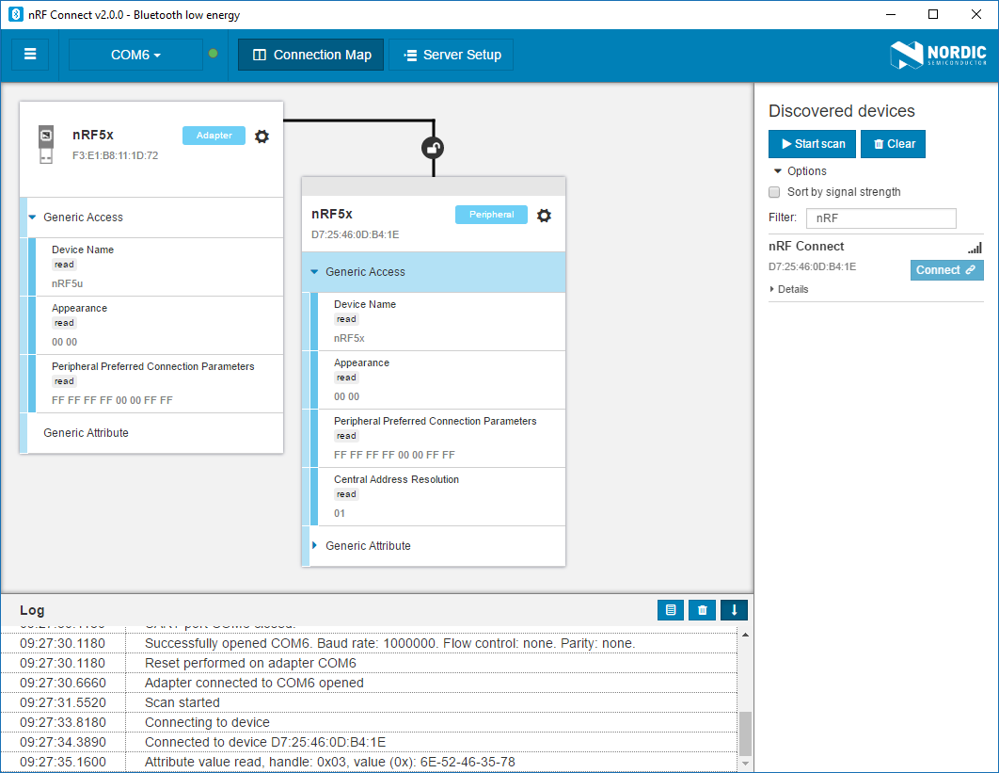

# nRF Connect Bluetooth Low Energy

 

*nRF Connect Bluetooth&reg; Low Energy* is a cross-platform tool that enables testing and development with Bluetooth Low Energy (previously called Bluetooth Smart). It allows easy setup of connections with other devices and use these connections for reading and writing to the external nodes.

*nRF Connect Bluetooth Low Energy* is implemented as an app for [nRF Connect](https://github.com/NordicSemiconductor/pc-nrfconnect-core#creating-apps).

The app is designed to be used together with the nRF52 DK, nRF51 DK, or the nRF51 Dongle, running a specific connectivity application.

# Installation

To install the application you can download binaries from the [nRF Connect product page](https://www.nordicsemi.com/eng/Products/Bluetooth-low-energy/nRF-Connect-for-desktop) on Nordic Semiconductor web pages.

nRF Connect currently supports the following operating systems:

* Windows
* Ubuntu Linux 64-bit
* macOS

After *nRF Connect* is installed, you can find *Bluetooth Low Energy* in the app list by selecting *Add/remove apps*.

# Usage documentation

A [User guide](http://infocenter.nordicsemi.com/topic/com.nordic.infocenter.tools/dita/tools/nRF_Connect/nRF_Connect_intro.html?cp=4_2) is available on the *nRF Connect Bluetooth Low Energy* product pages.

# Contributing

Feel free to file code related issues on [GitHub Issues](https://github.com/NordicSemiconductor/pc-nrfconnect-ble/issues) and/or submit a pull request. In order to accept your pull request, we need you to sign our Contributor License Agreement (CLA). You will see instructions for doing this after having submitted your first pull request. You only need to sign the CLA once, so if you have already done it for another project in the NordicSemiconductor organization, you are good to go.

# Compiling from source

Since *nRF Connect* expects local apps in `$HOME/.nrfconnect-apps/local` (Linux/macOS) or `%USERPROFILE%/.nrfconnect-apps/local` (Windows) directory, make sure your repository is cloned or linked there.

## Dependencies

To build this project you will need to install the following tools:

* Node.js (>=6.9)
* npm (>=5.6.0) / yarn (>=1.4.0)

## Compiling

When *nRF Connect* have been installed, you are ready to start the compilation. Run the following command from the command line, standing in the root folder of the repository:

    npm install

When the procedure has completed successfully you can run the application by running:

    npm run dev

The built app can be loaded by *nRF Connect* launcher.

## Testing

Unit testing can be performed by running:

    npm test

# License

See the [license file](LICENSE) for details.

# Feedback

* Ask questions on [DevZone Questions](https://devzone.nordicsemi.com)
* File code related issues on [GitHub Issues](https://github.com/NordicSemiconductor/pc-nrfconnect-ble/issues)
