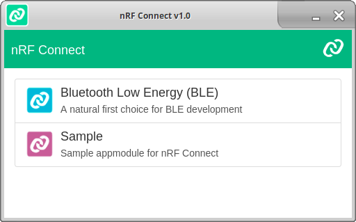

# nRF Connect Documentation

## Application Modules (appmodules) 

nRF Connect is modularized into application modules (appmodules). Each
appmodule provides a certain set of features. The appmodules are developed
independently, but may share some common components and resources from the core
module located in `packages/nrfconnect-core`.

### Loader

When starting the application, the users will be able to choose which appmodule
they want to load.



The appmodule loader is located in `packages/nrfconnect-loader`. The
`package.json` in this directory has dependencies to all appmodules that should be
used by the application. The loader will only display appmodules that are
defined in the `appmodules` field in `package.json`, f.ex:

```
"appmodules": [
  "nrfconnect-appmodule-ble",
  "nrfconnect-appmodule-sample"
]
```

If only one appmodule is defined here, then the loader UI will be skipped, and
the appmodule will be loaded immediately.

### Configuration

The appmodules are located in the `packages` directory. Each appmodule has its own 
directory containing code and resources, plus a `package.json` where 
metadata for the appmodule can be configured.

Example:

```
{
  "name": "nrfconnect-appmodule-ble",
  "version": "1.0.0",
  "description": "A natural first choice for BLE development",
  "homepage": "http://infocenter.nordicsemi.com/nrf-connect/ble",
  "main": "index.js",
  "author": "Nordic Semiconductor ASA",
  "config": {
    "title": "Bluetooth Low Energy (BLE)",
    "icon": "resources/icon.png"
  },
  scripts: {
    ...
  },
  dependencies: {
    ...
  }
}
```

Fields that are relevant for the nRF Connect application:

| Field                | Required  | Description |
| ---                  | ---       | ---         |
| `name`               | Yes       | The name of the appmodule. This name is used to reference the appmodule as a dependency in the main `package.json` file of the application. |
| `version`            | Yes       | The version of the appmodule. |
| `description`        | Yes       | The appmodule description. This is displayed in the loader UI. |
| `main`               | Yes       | The entrypoint of the appmodule. This file should contain code that is run by the Electron main process, which sets up events and initializes the browser window. This is invoked by the loader. |
| `homepage`           | No        | An URL that contains more information about the appmodule. Currently not in use, but in the future it may be used as a link in the loader UI, and the appmodule's "help" menu. |
| `author`             | No        | The author of the appmodule. Currently not in use, but in the future it may be displayed in the loader UI, and the appmodule's "about" menu. |
| `config.title`       | Yes       | The appmodule title. Will be displayed as name of the appmodule in the loader UI. |
| `config.icon`        | Yes       | Path to an image that will be used as an icon in the loader UI. |

### Sample appmodule

When developing a new appmodule, it is recommended to use 
[packages/nrfconnect-appmodule-sample](packages/nrfconnect-appmodule-sample) 
as a starting point. You can fork this repository and create a copy of 
the sample appmodule inside `packages`. 

```
cp -a packages/nrfconnect-appmodule-sample packages/nrfconnect-appmodule-<name>
```

Then edit the relevant fields (author, title, icon, etc.) in `package.json`.
You can then start developing your own components, reducers, and actions 
in the `js` directory. Unit testing with jest is enabled, and there is 
an example test in the `components` directory.

You can start the appmodule by running `npm start` in the appmodule directory. 
You can also test how the appmodule looks in the loader UI. In that case, 
add your appmodule as a dependency in `nrfconnect-loader/package.json` and
add it to the `appmodules` array in the same file. Go to the root of the 
project and run `npm run bootstrap` so that the loader and appmodule are
linked. Then run `npm start` in the `nrfconnect-loader` directory.

### Create appmodule from scratch

If you want to create an appmodule from scratch, you can create a separate Git 
repository and add `nrfconnect-core` as a dependency. You can use
whatever libraries and development tools you desire as long as you
remember the following:
- Your `package.json` must contain the required fields as described in the [configuration section](#configuration).
- The appmodule should follow the naming convention `nrfconnect-appmodule-<name>`.

The file you specify as `main` in `package.json` is loaded by the appmodule
loader. The code in this file is run by the Electron main process. This code
should create the browser window and load an html file, which finally loads 
your JavaScript app. The `nrfconnect-core` module contains a
`createBrowserWindow` function that simplifies this, described in the section
below.

#### createBrowserWindow

With `createBrowserWindow` you can easily initialize the Electron browser
window for use with nRF Connect. The behavior of this function can be
configured by passing in a set of options:

| Option                      | Required  | Default value  | Description |
| ---                         | ---       | ---            | --- |
| `url`                       | Yes       | -              | Path to the html file that should be loaded in the browser window. |
| `title`                     | No        | nRF Connect vX | The title that should be visible in the window title bar. |
| `keepWindowSettings`        | No        | `true`         | If `true`, the window size and maximized status is kept and reused next time the window is opened. |
| `splashScreen`              | No        | `false`        | If `true`, an nRF Connect splash screen is shown while the window is loading. |
| *standard Electron option*  | -         | -              | Any standard option from the [Electron BrowserWindow API](https://github.com/electron/electron/blob/master/docs/api/browser-window.md) |

Example usage:

```
var electron = require('electron');
var core = require('nrfconnect-core/index');

if (electron.app.isReady()) {
    initBrowserWindow();
} else {
    electron.app.on('ready', function () {
        initBrowserWindow();
    });
}

function initBrowserWindow() {
    core.createBrowserWindow({
        title: 'My nRF Connect appmodule',
        url: 'file://' + __dirname + '/index.html',
        icon: __dirname + '/resources/icon.png'
    });
}
```

If the application is already ready, f.ex. if the appmodule is being loaded from
the nRF Connect loader, we load the browser window immediately. If not,
we wait until the application is ready before loading the window. This allows
us to support loading the appmodule either through the loader or as a
standalone application.

You can also reuse metadata from your `package.json` when creating the browser
window. Simply require it, and supply the relevant values:

```
var packageJson = require('./package.json');

core.createBrowserWindow({
    title: packageJson.config.title,
    url: 'file://' + __dirname + '/index.html',
    icon: __dirname + '/' + packageJson.config.icon
});
```

The `createBrowserWindow` function returns the browser window instance. Refer
to the [Electron BrowserWindow API](https://github.com/electron/electron/blob/master/docs/api/browser-window.md)
to see available events, functions, and properties for this instance. Events can 
f.ex. be configured like this:

```
var browserWindow = core.createBrowserWindow({...});

browserWindow.webContents.on('new-window', function (e, url) {
    e.preventDefault();
    shell.openExternal(url);
});
```

### Remaining work

The following work is planned, but not completed yet:
- Ability to go back to the loader after having selected an appmodule.
- Mechanism for remembering which appmodule the user has selected, so that it can be loaded by default the next time the application starts.
- Online update mechanism for appmodules.
