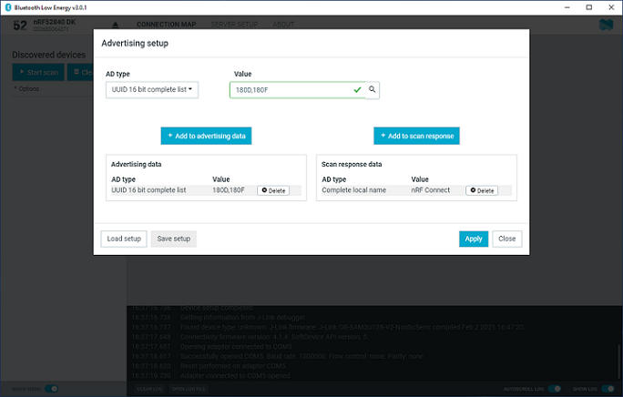

# Setting up advertising

The nRF Connect Bluetooth® Low Energy app enables the local device to operate as a peripheral that can send connectable advertising packets. The contents of the advertising packets can be configured in the advertising setup.

To start sending advertising packets, complete the following steps:

1. Click the local [**Device options**](./overview_and_ui.md#device-options) button.
2. To start advertising the device, click **Start advertising**.
3. Specify the contents of the advertising packets:

     

     1. Click the local [**Device options**](./overview_and_ui.md#device-options) button.
     2. To display the **Advertising setup** dialog, click **Advertising setup**.
     3. From the AD type drop-down menu, select an AD type.
     4. In the Value field, add a data value.
     5. Select **Add to advertising data** or **Add to scan response**.
     6. Repeat until all wanted fields are present.
     7. Click **Apply**, then click **Close**.

To save an advertising setup to file for later use, complete the following steps:

1. Click the **Save setup** button.
2. Choose a directory and type a file name, then click **Save**.

To load a previously saved advertising setup from a file, complete the following steps:

1. Click the **Load setup** button.
2. Navigate to the right directory and select the file, then click **Open**.