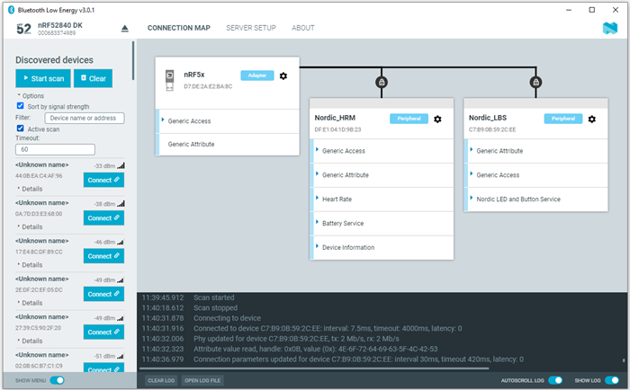
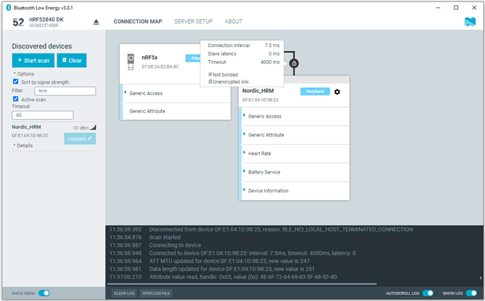

# Establishing Bluetooth Low Energy connections

The nRF Connect Bluetooth® Low Energy app can establish and maintain up to eight simultaneous Bluetooth Low Energy connections.

To connect to devices, complete the following steps:

1. To scan for nearby Bluetooth devices, click the **Start scan** button in the [**Discovered devices**](./overview_and_ui.md#discovered-devices-panel) side panel. 
    The [entries](./overview_and_ui.md#discovered-devices-entries) for nearby advertising devices start to appear in the side panel.

    !!! tip "Tip"
          For information on how to set up advertising for a device, see [Setting up advertising](./advertising_setup.md).

1. To establish a Bluetooth connection with a peer device, click the **Connect** button associated with the device.

    

When the connection has been established, a new peripheral device appears in the **Connection Map**, to the right of the local device. The nRF Connect Bluetooth Low Energy app automatically performs an initial service discovery. The discovered services are listed below the connected device. Attributes that are known to the application are shown by their name. Attributes that are unknown to the application are shown by their UUID only. For information on how to add UUID definitions, see [Adding UUID definitions](./adding_uuid_defs.md).

A line connects the local and remote device signaling that they are connected over Bluetooth. To open a connection info dialog displaying the parameters of the connection, encryption, and bond state, hover the mouse pointer over the padlock icon.

