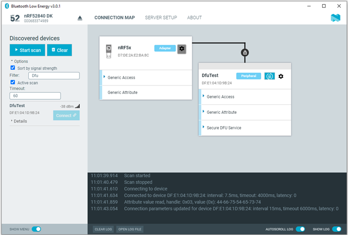
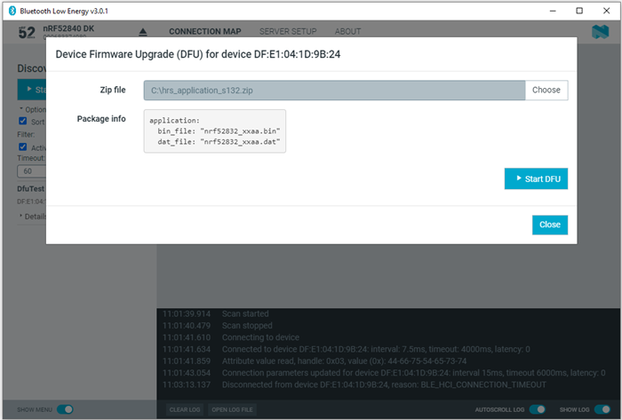
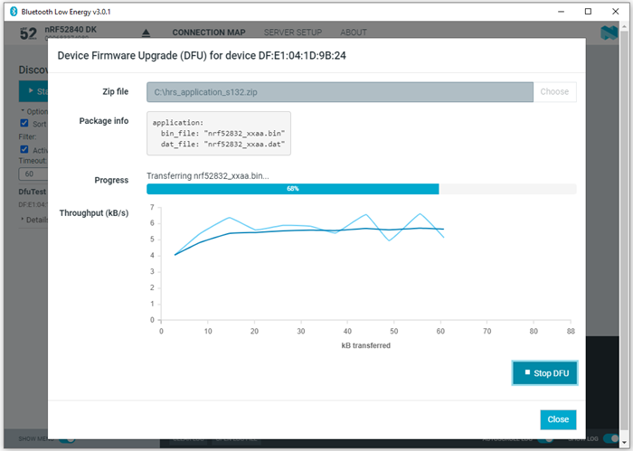
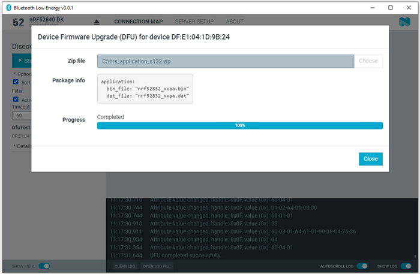

# Updating firmware over the air

If the connected device has Nordic Device Firmware Update (DFU) Service, you can update the firmware on the device.

For more information on the DFU process, see [Device Firmware Update process](https://docs.nordicsemi.com/bundle/sdk_nrf5_v17.1.0/page/lib_bootloader_dfu_process.html). For DFU bootloader examples, see [DFU bootloader examples](https://docs.nordicsemi.com/bundle/sdk_nrf5_v17.1.0/page/examples_bootloader.html).

For a device that has DFU Service, Secure DFU appears in the device's list of discovered services, and the **Start Secure DFU** button appears in the list header.

To update the firmware, complete the following steps:

1. To open the DFU dialog, click the **Start Secure DFU** button .
2. Browse and select a DFU zip package file on your computer.

    !!! tip "Important"
         To create the DFU zip package file, use the nRF Util tool. See the [nRF Util documentation](https://docs.nordicsemi.com/bundle/nrfutil/page/README.html) for more information.
    Information on the content of the DFU zip package is displayed in the **Package info** field.

    

3. To start the transfer of the DFU package to the connected peer device, click **Start DFU**. 
   The progress bar shows the progress of the transfer.

    

4. When the progress bar has reached 100%, click **Close**.

    

To stop the transfer, click **Stop DFU**. The transfer continues from where it was stopped when you click **Start DFU** again.

If you click **Close** before the DFU transfer has completed, a confirmation dialog appears. If you click **OK** in the confirmation dialog, the transfer is canceled.