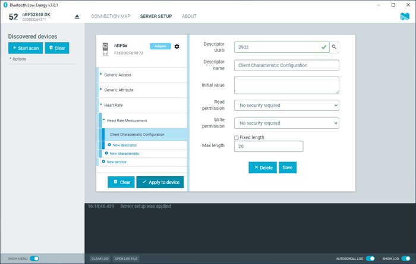

# Configuring server setup

The nRF Connect Bluetooth® Low Energy app supports the configuration of the local device's GATT (Generic Attribute profile) attribute table, also known as server setup. Adding attributes to the server setup allows the local device to exchange data with a connected peer device.

The default server setup consists of two mandatory services: GATT and GAP (Generic Access Profile). These services can be modified, but they cannot be removed, and you cannot extend them with more characteristics or descriptors.

To add new attributes to the server setup, complete the following steps:

1. In the navigation bar, click the **Server setup** button. 
   Initially, the default server setup that is displayed contains only GAP and GATT services.
2. Click **New service**.
3. Select the service you just added. 
   A form is displayed.
4. Define the attribute values, then click **Save**.
5. To add a new characteristic, expand the added **New Service**, then click **New characteristic**.
6. Select the characteristic you just added. 
   A form is displayed.
7. Define the attribute values, then click **Save**. 

    !!! note "Note"
         When adding a notify or indicate property on a characteristic, you need to add a Client Characteristic Configuration Descriptor (CCCD) for that characteristic.

8. To add a new descriptor, expand the added **New Characteristic**, then click **New descriptor**.
9. Select the descriptor you just added. 
   A form is displayed.
10. Define the attribute values, then click **Save**.
11. When you have completed the server setup, click **Apply to device** to upload the setup to the local device.

     

To save a server setup to file for later use, complete the following steps:

1. Click the local [**Device options**](./overview_and_ui.md#device-options) button.
2. Click **Save setup...**.
3. Choose a directory and type a file name, then click **Save**.

To load a previously saved server setup from a file, complete the following steps:

1. Click the local [**Device options**](./overview_and_ui.md#device-options) button.
2. Click **Load setup...**.
3. Navigate to the right directory and select the file, then click **Open**.

!!! note "Note"
      If you remove or overwrite a setup from the device, you need to reset and reopen it. When prompted, confirm the reset.

After the setup has been applied to the device, you can view the resulting setup by clicking the **Connection map** button in the navigation bar. The new setup is reflected in the local device.