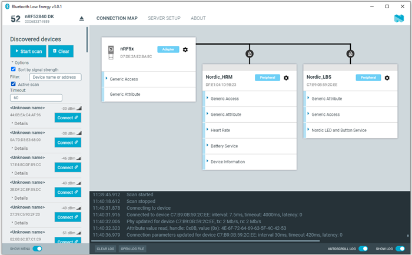

# Overview and User Interface

After starting the {{app_name}}, the application window is displayed.

The window consists of the following main elements.

## Select Device

To the upper left, you can select a local serial device. You can use the selected local device to scan for Bluetooth Low Energy devices, which are listed in the side panel below.

You can access the following options by selecting the arrow under the device name.

- Show the device at the top of the list by making it favorite.
- Rename the device.
- View and select between device serial ports.

## Discovered devices panel

The **Discovered devices** side panel lets you scan for nearby Bluetooth devices.

The following options are available:

| Feature                       | Description                                                                                                                                                                                                                                                   |
|-------------------------------|---------------------------------------------------------------------------------------------------------------------------------------------------------------------------------------------------------------------------------------------------------------|
| **Start scan**                | Starts the scan for advertising Bluetooth devices nearby. The scan continues until you click **Stop scan** or until it hits the **Timeout** value.                                                                                                        |
| **Clear**                     | Clears the list of the devices.                                                                                                                                                                                                                                |
| **Sort by signal strength**   | Check the box to sort the list according to signal strength and thus according to which device is closest.                                                                                                                                                  |
| **Filter**                    | Type device name or address to run a fuzzy live search through the list of discovered devices.                                                                                                                                                              |
| **Active scan**               | Check the box to run the scan without timeout. If unchecked, the scan will run for the amount of time specified in the **Timeout** field.                                                                                                                  |
| **Timeout**                   | Time value in seconds during which the scan runs when the **Active scan** field is not checked.                                                                                                                                                              |

### Discovered devices entries

When you [start scanning](./connecting_devices.md) and discover nearby devices, the side panel is updated.
Each entry in the list shows the name, address, and RSSI of the received advertising packet.
The details include information about the advertising type and data fields of a packet.

For information on how to set up advertising for a device, see [Setting up advertising](./advertising_setup.md).

## Connection Map tab

This tab is initially empty but will be populated with local and remote Bluetooth Low Energy devices when you [connect](./connecting_devices.md) to a discovered device.
After that, you will be able to [view service details](./service_discovery.md) for the devices.

### Device options

To expand a menu that shows actions and configurations available for the local device with an active connection, click the **Device options** button (the cog icon next to the **Adapter** field).

.

## Server Setup tab

You can configure the local device's GATT (Generic Attribute profile) attribute table. Adding attributes to the server setup allows the local device to exchange data with a connected peer device.

.

See [Configuring server setup](./maintaining_server_setup.md) for information about what you can do in this tab.

## About tab

You can view application information, restore defaults, access source code, and documentation. You also can find information on the selected device, access support tools, and enable verbose logging.

## Log

The Log panel allows you to view the most important log events, tagged with a timestamp. Each time you open the app, a new session log file is created. You can find the Log panel and its controls, below the main application window.

- When troubleshooting, to view more detailed information than shown in the Log panel, use **Open log file** to open the current log file in a text editor.
- To clear the information currently displayed in the Log panel, use **Clear Log**. The contents of the log file are not affected.
- To hide or display the Log panel in the user interface, use **Show Log**.
- To freeze Log panel scrolling, use **Autoscroll Log**.