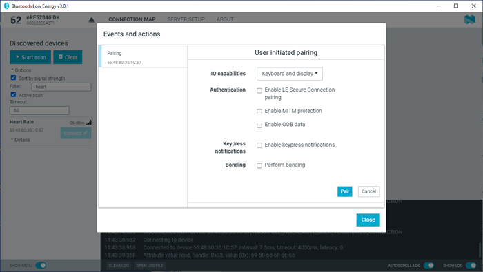

# Pairing devices

Pairing is the process of exchanging security keys and establishing an encrypted link. The level of security is configurable, and it ranges from an unencrypted link with no security to an encrypted link with authentication and protection against Man-in-the-Middle (MITM) attacks.

To pair with a connected device, complete the following steps:

1. To view device options for the connected device, click the [**Device options**](./overview_and_ui.md#device-options) button.
2. To open the Pairing dialog, click **Pair...**.

    

    - To define the device's Input/Output capabilities, use **IO capabilities**.
    - **LE Secure Connection pairing** provides protection against eavesdropping and MITM attacks. It uses an Elliptic Curve Diffie-Hellman (ECDH) key agreement to derive encryption keys. It was introduced as an alternative to LE Legacy pairing, in version 4.2 of the Bluetooth® Low Energy Core Specification.
    - When using LE Legacy pairing, you can use the following:

        - To enable MITM protection, use **MITM**.
        - To enable Out of Band (OOB) pairing, enable **OOB data**.

    - When doing LESC, to inform the remote device when keys have been entered or erased, use **Keypress notification**.
    - To re-establish a secure link, without having to go through the pairing process each time, use **Perform Bonding**, which means long-term keys are created and exchanged.

3. Set the desired parameters in the dialog, then click **Pair**. 
   Depending on the chosen security parameters, an additional dialog may be shown for passkey, out-of-band data, or numerical comparison input.
5. To close the Pairing dialog, click **Close**.

When the pairing procedure has been completed, the following changes are displayed:

- A log entry shows the new security level of the connection.
- The pairing text in **Event and actions** view turns green to indicate success.
- The connection info padlock icon changes to solid white , if the connection is encrypted. Otherwise, a padlock outline is displayed .

    !!! note "Note"

        - Bonding is supported, but the keys are not retained across application restarts.
        - Address resolving is currently not supported. Therefore, using keys from a bond after the device has changed address will most likely fail.
        - LE Security bonding might not work for some configurations.

The {{app_name}} can reply automatically to an incoming pairing request by default, or it can be handled by the user.

To select the reply option for pairing requests, complete the following steps:

1. Click the local [**Device options**](./overview_and_ui.md#device-options) button.
2. Select or deselect **Auto reply security requests**. 
   When **Auto reply security requests** is selected, the {{app_name}} uses the settings specified in **Security parameters** when automatically replying to the request.

To edit security parameters, complete the following steps:

1. Click the local [**Device options**](./overview_and_ui.md#device-options) button.
2. To open the **Security parameters** dialog, click **Security parameters**.
3. Click **Apply** when done.