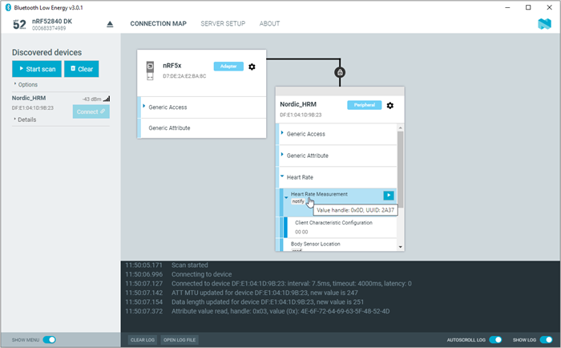

# Viewing service details

The {{app_name}} can discover and display services, characteristics, and descriptors of a connected peer device's attribute table.

- To view the handle and UUID of an attribute, move the mouse pointer over the attribute name. 
  A hover text is displayed.

- To view the characteristics of a service, click the **Expand/collapse icon** . 
  The characteristics have different buttons available depending on the associated properties. Read, write, and notify actions are available if the corresponding properties are available for the characteristic.

- To view descriptors, expand the characteristics.

- To configure the peer device to start sending notifications, click the **Toggle notifications** icon .

When a device receives a notification, the corresponding attribute is highlighted, and its value is updated.

If a service or characteristic does not have any child attributes, the list is empty when you click the **Expand/collapse** icon.
