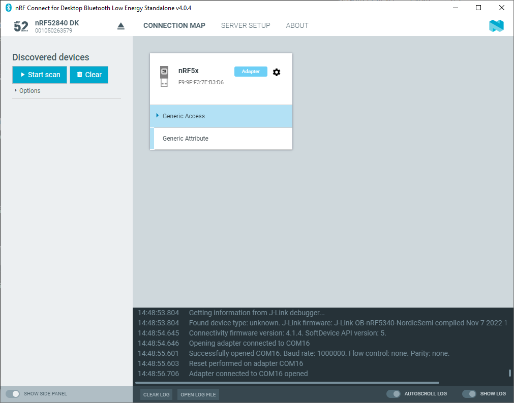

# Establishing serial port connection to a local device

The {{app_name}} requires a serial port connection to a local Development Kit (DK) or dongle. The nRF System on Chip (SoC) on the device is controlled by the app, which sends serialized commands to it over a serial port.

To set up a local device, complete the following steps:

1. Connect the device to a Universal Serial Bus (USB) port on your computer and power it on.
2. In the navigation bar, click on **Select device**. 
   The list of connected devices appears under the button.
3. Select the device by clicking on its name. 
   The name of the selected device is displayed on the navigation bar.
4. If the device has not been used with the {{app_name}} before, you may be asked to update the J-Link firmware and connectivity firmware for the device. You need to have the correct connectivity firmware on the nRF SoC to continue. The programming can take up to 30 seconds.

    

    !!! note "Note"
          If programming fails, check the solution to the [Programming with J-Link does not work](./troubleshooting.md#programming-with-j-link-does-not-work) issue on the Troubleshooting page.

When the nRF SoC has been programmed with the correct firmware, the {{app_name}} proceeds to connect to it over Universal Asynchronous Receiver/Transmitter (UART). When the connection is established, the device appears in the main view.

The local device is labeled Adapter to signal that it is connected locally to the computer. The device name and Bluetooth device address are shown at the top. The attribute table of the device is shown below them. Use the [**Device options**](./overview_and_ui.md#device-options) button to see actions and configurations available for the device.

!!! note "Note"
      When using macOS, an issue with the SEGGER J-Link OB firmware leads to the corruption of long packets over UART. See [www.nordicsemi.com/nRFConnectOSXfix](https://devzone.nordicsemi.com/nordic/nordic-blog/b/blog/posts/nrf-connect-v10-release#osxissue) for more information.
