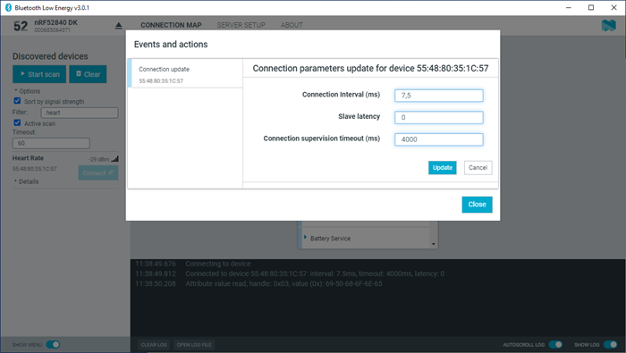

# Updating connection parameters

In a connection, you can request new connection parameters and respond to an incoming connection parameter update request.

To define connection parameters, complete the following steps:

1. To view device options for the connected device, click the [**Device options**](./overview_and_ui.md#device-options) button.
2. To open the **Connection update** dialog, click **Update connection...**. 

    

3. Set the desired parameters in the dialog, then click **Update**.
4. To close the dialog, click **Close**.

There are two main options for responding to update requests: Letting the {{app_name}} accept the request automatically (default) or responding to the request manually.

To select the responding option, complete the following steps:

1. Click the local [**Device options**](./overview_and_ui.md#device-options) button.
2. Select or deselect **Auto accept update requests**.