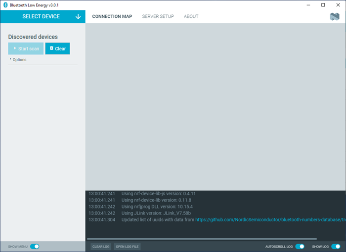
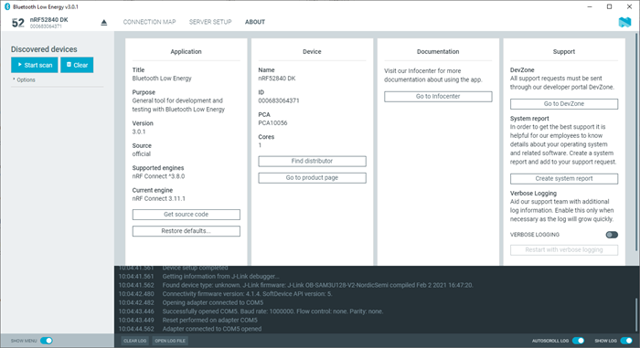

# Overview and User Interface

After starting nRF Connect Bluetooth® Low Energy, the application window is displayed.

It consists of the following main elements.

## Select Device

To the upper left, you can select a local serial device. You can use the selected local device to scan for Bluetooth Low Energy devices, which are listed in the side panel below.

You can switch between the following application tabs, using the navigation bar.

## Connection Map

This view is initially empty but will be populated with local and remote Bluetooth Low Energy devices when they are discovered.

## Server Setup

You can configure the local device's GATT (Generic Attribute profile) attribute table. Adding attributes to the server setup allows the local device to exchange data with a connected peer device.

## About tab

You can view application information, restore defaults, access source code, and documentation. You also can find information on the selected device, access support tools, and enable verbose logging.

## Log

The Log panel allows you to view the most important log events, tagged with a timestamp. Each time you open the app, a new session log file is created. You can find the Log panel and its controls, below the main application window.

- When troubleshooting, to view more detailed information than shown in the Log panel, use **Open log file** to open the current log file in a text editor.
- To clear the information currently displayed in the Log panel, use **Clear Log**. The contents of the log file are not affected.
- To hide or display the Log panel in the user interface, use **Show Log**.
- To freeze Log panel scrolling, use **Autoscroll Log**.