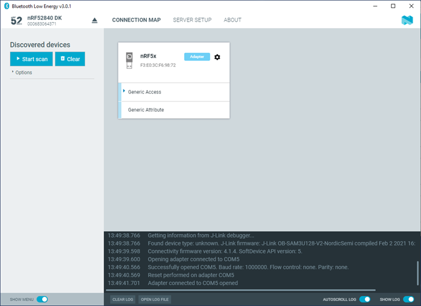

# Establishing serial port connection to a local devices

The nRF Connect Bluetooth® Low Energy app requires a serial port connection to a local Development Kit (DK) or dongle. The nRF System on Chip (SoC) on the device is controlled by the app, which sends serialized commands to it over a serial port.

To set up a local device, complete the following steps:

1. Connect the device to a Universal Serial Bus (USB) port on your computer and power it on.
2. In the navigation bar, click on **Select device**.
3. Select a device by clicking on its name in the drop-down list. You can access the following options by selecting the arrow under the device name.

   - Show the device at the top of the list by making it favorite.
   - Rename the device.
   - View and select between device Com Ports.

The name of the selected device is displayed on the navigation bar.

If the device has not been used with the nRF Connect Bluetooth Low Energy app before, you may be asked to update the J-Link firmware and connectivity firmware for the device. You need to have the correct connectivity firmware on the nRF SoC to continue. When the nRF SoC has been programmed with the correct firmware, the nRF Connect Bluetooth Low Energy app proceeds to connect to it over Universal Asynchronous Receiver/Transmitter (UART). When the connection is established, the device appears in the main view.

!!! note "Note"
      When using OS X, an issue with the SEGGER J-Link OB firmware leads to the corruption of long packets over UART. See [www.nordicsemi.com/nRFConnectOSXfix](www.nordicsemi.com/nRFConnectOSXfix) for more information.

The local device is labeled Adapter to signal that it is connected locally to the computer. The device name and Bluetooth device address are shown at the top. The attribute table of the device is shown below them.

To expand a menu that shows actions and configurations available for the local device, click the **Device options** icon .